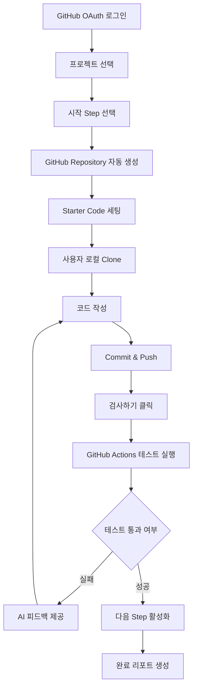
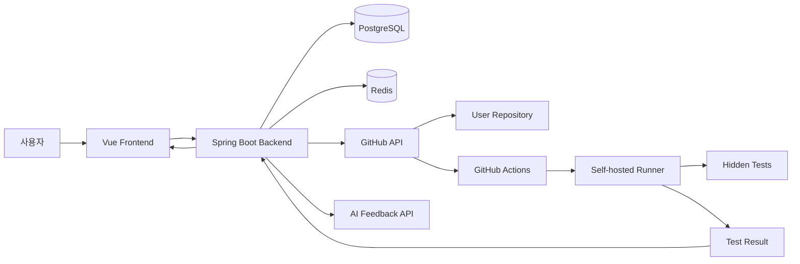

# 🐵 Codemong README 

> GitHub 기반 단계별 프로젝트 학습 플랫폼

> 사용자가 직접 코드를 작성하고, 테스트 검증과 AI 피드백을 통해 프로젝트를 완주할 수 있도록 돕는 개발 학습 서비스

---

## 1. 프로젝트 소개

**코드몽**은 백엔드 개발자가 실제 프로젝트를 단계별로 구현하며 학습할 수 있도록 돕는 플랫폼입니다.

일반적인 강의형 학습은 코드를 따라 치는 데서 끝나는 경우가 많고, 개인 프로젝트는 어디서부터 시작해야 할지 막막한 경우가 많습니다. CodeMong은 이 문제를 해결하기 위해 **GitHub Repository 자동 생성, 단계별 미션, 테스트 기반 검증, AI 피드백**을 하나의 학습 흐름으로 연결했습니다.

사용자는 원하는 프로젝트와 시작 단계를 선택하고, 자동 생성된 GitHub Repository에서 직접 코드를 작성합니다. 이후 `검사하기`를 누르면 GitHub Actions 기반 테스트가 실행되고, 실패한 경우 AI가 코드와 테스트 결과를 바탕으로 개선 방향을 제시합니다.

---

## 2. 핵심 문제의식

개발 학습 과정에서 다음과 같은 문제가 자주 발생합니다.

* 강의나 예제 코드를 따라 했지만 실제 프로젝트에 적용하기 어렵다.
* 개인 프로젝트를 시작하려고 해도 초기 세팅과 구조 설계에서 막힌다.
* 기능을 구현했지만 제대로 동작하는지 객관적으로 검증하기 어렵다.
* 테스트 실패 원인을 혼자 분석하기 어렵다.
* 어떤 순서로 기능을 확장해야 할지 알기 어렵다.

CodeMong은 이러한 문제를 해결하기 위해 **실제 GitHub 개발 흐름과 테스트 검증, AI 피드백을 결합한 단계형 프로젝트 학습 환경**을 제공합니다.

---

## 3. 주요 기능

### 3.1 GitHub OAuth 로그인

사용자는 GitHub OAuth를 통해 로그인합니다.

* GitHub 계정 기반 로그인
* 최초 로그인 시 자동 회원가입
* 사용자별 GitHub Repository 생성 권한 연동
* JWT 기반 인증 처리

---

### 3.2 프로젝트 선택

사용자는 학습하고 싶은 프로젝트를 선택할 수 있습니다.

현재 제공 또는 구현 중인 학습 트랙은 다음과 같습니다.

| 프로젝트          | 설명                                                      |
| ------------- | ------------------------------------------------------- |
| CRUD 게시판 프로젝트 | 게시글 생성, 조회, 수정, 삭제, 댓글, 페이지네이션 등 기본 백엔드 기능 학습           |
| Market | 기본적인 생성, 조회, 수정, 삭제에 더해 파일 업로드를 학습 |
| JPA Lab       | 연관관계 매핑, N+1 문제, Fetch Join, DTO Projection 등 JPA 심화 학습 |
| Security Lab  | URL 접근 제어, Access Token, JWT 인증 필터, Refresh Token 학습    |
... 계속 추가 중 입니다.
---

### 3.3 Step 기반 학습

각 프로젝트는 여러 Step으로 나뉘어 있습니다.

예시: CRUD 게시판 프로젝트

| Step    | 학습 내용          |
| ------- | -------------- |
| Step 01 | 게시글 생성 및 단건 조회 |
| Step 02 | 게시글 목록 조회      |
| Step 03 | 페이지네이션         |
| Step 04 | 댓글 기능          |
| Step 05 | 검증 및 예외 처리     |

사용자는 처음부터 시작하거나, 자신이 연습하고 싶은 특정 Step부터 시작할 수 있습니다.

---

### 3.4 GitHub Repository 자동 생성

프로젝트를 시작하면 CodeMong이 사용자의 GitHub 계정에 학습용 Repository를 자동으로 생성합니다.

생성되는 Repository 예시:

```text
codemong-board
codemong-jpa-lab
codemong-security-lab
```

자동 생성 과정:

```text
프로젝트 선택
→ 시작 Step 선택
→ GitHub Repository 생성
→ 시작 Step 기준 Starter Code 세팅
→ 학습 Branch 생성
```

---

### 3.5 Branch 기반 Step 진행

CodeMong은 Step 단위로 Branch를 관리합니다.

예시:

```text
step01-260625
step02-260625
step03-260625
```

사용자는 해당 Branch에서 코드를 작성하고 push한 뒤, 웹에서 `검사하기`를 실행합니다.

---

### 3.6 GitHub Actions 기반 검사

사용자가 `검사하기`를 누르면 CodeMong은 GitHub Actions workflow를 실행합니다.

검사 흐름:

```text
사용자 코드 push
→ CodeMong에서 검사하기 클릭
→ GitHub Actions workflow_dispatch 실행
→ Hidden Test 복사
→ Gradle Test 실행
→ 결과 수집
→ 성공/실패 판단
```

검사는 사용자의 최신 Commit SHA를 기준으로 수행됩니다.

---

### 3.7 Hidden Test 기반 검증

각 Step에는 학습자가 볼 수 없는 Hidden Test가 존재합니다.

Hidden Test는 다음 원칙을 따릅니다.

* 공개된 요구사항만 검증한다.
* 과도하게 내부 구현 방식을 강제하지 않는다.
* API 응답, DB 상태, 예외 처리 등 실제 동작을 중심으로 검증한다.
* 이전 Step의 요구사항이 유지되는지 누적 검증한다.

---

### 3.8 AI 피드백

검사에 실패한 경우, CodeMong은 테스트 결과와 코드 맥락을 바탕으로 AI 피드백을 제공합니다.

AI 피드백 예시:

```text
실패 원인:
게시글 목록 조회 시 createdAt 기준 내림차순 정렬이 적용되지 않았습니다.

수정 방향:
PageRequest 생성 시 Sort.by(Direction.DESC, "createdAt") 조건을 추가해보세요.

관련 위치:
BoardService.findAll()
```

단순히 실패 여부만 알려주는 것이 아니라, 사용자가 다음 행동을 결정할 수 있도록 수정 방향을 제공합니다.

---

### 3.9 완료 리포트

프로젝트 또는 Step을 완료하면 학습 결과를 리포트로 확인할 수 있습니다.

리포트 예시:

* 완료한 Step
* 실패한 테스트 이력
* 재시도 횟수
* 주요 피드백
* 개선된 부분
* 추가 학습 추천

---

### 3.10 부가 기능

CodeMong은 프로젝트 학습 외에도 지속적인 학습을 돕기 위한 기능을 제공합니다.

* DailyMong 학습 메일
* 문제 풀이 및 AI 검토
* 문의 챗봇
* 학습 리포트
* 프로젝트 진행률 관리

---

## 4. 서비스 흐름



---

## 5. 시스템 아키텍처



---

## 6. 기술 스택

### Frontend

| 기술         | 설명                |
| ---------- | ----------------- |
| Vue 2      | 프론트엔드 프레임워크       |
| Vue Router | 페이지 라우팅           |
| Axios      | API 통신            |
| CSS        | 반응형 UI 및 커스텀 스타일링 |

### Backend

| 기술              | 설명                              |
| --------------- | ------------------------------- |
| Java 21         | 백엔드 개발 언어                       |
| Spring Boot     | 백엔드 프레임워크                       |
| Spring Security | 인증/인가                           |
| Spring Data JPA | ORM                             |
| PostgreSQL      | 메인 데이터베이스                       |
| Redis           | 캐시 및 상태 관리                      |
| GitHub API      | Repository, Branch, Workflow 연동 |
| GitHub Actions  | 사용자 코드 테스트 실행                   |
| OpenAI API      | AI 피드백 생성                       |

### Infrastructure

| 기술                 | 설명                       |
| ------------------ | ------------------------ |
| AWS EC2            | 백엔드 서버 운영                |
| AWS RDS            | PostgreSQL 운영            |
| Nginx              | Reverse Proxy            |
| Systemd            | Spring Boot 서비스 관리       |
| Self-hosted Runner | GitHub Actions 테스트 실행 환경 |

---

## 7. 주요 도메인

### User

GitHub OAuth를 통해 로그인한 사용자 정보를 관리합니다.

### Project

CodeMong에서 제공하는 학습 프로젝트 정보를 관리합니다.

### Step

각 프로젝트의 단계별 미션 정보를 관리합니다.

### Repository

사용자별 GitHub Repository 정보를 관리합니다.

### Check

사용자 코드 검사 요청과 결과를 관리합니다.

### Feedback

AI 피드백 결과를 관리합니다.

### Report

학습 완료 결과와 리포트를 관리합니다.

---

## 8. 주요 API 예시

### 프로젝트 목록 조회

```http
GET /api/projects
```

### 프로젝트 시작

```http
POST /api/repositories/{projectId}
```

### 검사하기 실행

```http
POST /api/checks
```

### 검사 결과 조회

```http
GET /api/checks/{checkId}
```

### AI 피드백 조회

```http
GET /api/feedbacks/{checkId}
```

---

## 9. GitHub Actions 검사 구조

CodeMong의 검사 시스템은 다음 구조로 동작합니다.

```text
checker repository
├── backend
│   ├── mmcafe
│   │   ├── step01
│   │   │   └── tests
│   │   ├── step02
│   │   │   └── tests
│   │   └── ...
│   ├── jpa-lab
│   │   ├── step01
│   │   └── ...
│   └── security-lab
│       ├── step01
│       └── ...
```

검사 과정:

```text
1. checker repository checkout
2. 사용자 repository checkout
3. project_id와 step_id 기준 Hidden Test 선택
4. 사용자 repository에 테스트 복사
5. ./gradlew test 실행
6. 결과 artifact 업로드
7. CodeMong Backend가 결과 수집
```

---

## 10. 프로젝트 구조

### Backend

```text
backend/
  src/
    main/
      java/
        com/codemong/be/
          domain/
          global/
          github/
          auth/
          project/
          repository/
          check/
          feedback/
          report/
      resources/
        application.yml
```

### Frontend

```text
frontend/
  src/
    components/
    views/
    router/
    api/
    assets/
    styles/
```

---

## 11. 실행 방법

### Backend 실행

```bash
cd backend
./gradlew clean build
java -jar build/libs/app.jar
```

또는 개발 환경에서:

```bash
./gradlew bootRun
```

### Frontend 실행

```bash
cd frontend
npm install
npm run serve
```

### 환경변수 예시

```env
DATABASE_URL=
DATABASE_USERNAME=
DATABASE_PASSWORD=

REDIS_HOST=
REDIS_PORT=
```

민감정보는 반드시 `.env` 또는 서버 환경변수로 관리하며, GitHub에 커밋하지 않습니다.

---

## 12. 팀원 및 역할 분담

| 이름  | 역할                                    | 주요 담당                                                                                                              |
| --- | ------------------------------------- | ------------------------------------------------------------------------------------------------------------------ |
| 윤성빈 | Backend / Infra / GitHub Actions / AI | 프로젝트 생성 API, GitHub Repository 및 Branch 자동 생성, GitHub Actions 검사 흐름, Self-hosted Runner 구성, AI 피드백 흐름, 배포 및 인프라 관리 |
| 최현철 | Frontend / Auth / User Flow           | GitHub OAuth 로그인 및 최초 회원가입 흐름, 사용자 화면 구현, 프로젝트 선택/Step 선택 UI, 검사 결과 및 피드백 화면, 리포트 화면, 전체 사용자 경험 개선                 |

---

## 13. 상세 역할

### 윤성빈

* Spring Boot 백엔드 구조 설계
* 프로젝트 및 Step 도메인 설계
* Vue 기반 프론트엔드 화면 구현
* GitHub Repository 자동 생성 기능 구현
* 사용자 Branch 생성 및 Starter Code 세팅 흐름 구현
* GitHub Actions `workflow_dispatch` 기반 검사 시스템 구현
* Hidden Test 복사 및 Gradle Test 실행 구조 설계
* Self-hosted Runner 운영 및 EC2 환경 구성
* 테스트 결과 파싱 및 검사 상태 관리
* AWS EC2, RDS, Nginx 기반 배포 운영
  

### 최현철

* Spring Boot 백엔드 구조 설계
* GitHub OAuth2 로그인 구현
* 최초 로그인 시 사용자 자동 회원가입 처리
* JWT 기반 로그인 상태 연동
* Step 선택 및 프로젝트 생성 시, 로딩화면 구현
* AI 피드백 생성 흐름 설계
* RAG 기반 코드 맥락을 활용한 질의 서비스 구현
* 사용자 편의성을 고려한 UI/UX 개선
* 백엔드 API 연동 및 화면 상태 관리

---

## 14. 트러블슈팅 및 기술적 고민

### 14.1 GitHub Actions 검사 속도 문제

초기에는 GitHub-hosted runner를 사용했지만, 검사 대기 시간이 길어지는 문제가 있었습니다.
이를 해결하기 위해 EC2에 self-hosted runner를 구성하여 검사 환경을 직접 운영했습니다.

### 14.2 Gradle 테스트 환경 문제

사용자 Repository에 Gradle Wrapper가 없으면 GitHub Actions에서 테스트를 실행할 수 없는 문제가 있었습니다.
이를 해결하기 위해 각 Starter Code에 Gradle Wrapper를 포함하고, 모든 Step에서 독립적으로 테스트가 가능하도록 구성했습니다.

### 14.3 Step 기반 코드 흐름 설계

각 Step은 독립적인 템플릿이 아니라, 이전 Step의 정답 코드를 이어받는 방식으로 설계했습니다.

```text
step02 starter == step01 solution
step03 starter == step02 solution
step04 starter == step03 solution
```

이 구조를 통해 사용자는 실제 프로젝트를 점진적으로 확장하는 방식으로 학습할 수 있습니다.

### 14.4 AI 피드백 비용 문제

사용자 코드 전체를 매번 AI Context로 전달하면 비용이 커질 수 있습니다.
이를 해결하기 위해 변경된 코드, 테스트 실패 로그, 관련 파일 중심으로 Context를 구성하는 방식을 검토했습니다.

### 14.5 EC2 리소스 문제

Self-hosted runner와 Spring Boot API를 같은 EC2에서 실행할 경우, Gradle 테스트 실행 시 리소스 부족 문제가 발생할 수 있었습니다.
이를 해결하기 위해 runner 동시 실행 수 제한, 인스턴스 사양 조정, 서비스 분리 가능성을 검토했습니다.

---

## 15. 프로젝트 차별점

CodeMong은 단순한 강의 플랫폼이나 문제 풀이 사이트가 아닙니다.

| 기존 방식          | CodeMong                  |
| -------------- | ------------------------- |
| 강의를 보고 따라침     | 직접 GitHub Repository에서 구현 |
| 정답 코드를 확인      | Hidden Test로 기능 검증        |
| 실패 원인을 혼자 분석   | AI가 실패 원인과 수정 방향 제공       |
| 모든 기능을 처음부터 구현 | 원하는 Step부터 시작 가능          |
| 학습 결과가 흩어짐     | 완료 리포트로 학습 이력 관리          |

CodeMong은 실제 개발자가 사용하는 GitHub 기반 개발 흐름을 학습 과정에 그대로 녹여낸 서비스입니다.

---

## 16. 향후 개선 방향

* AI 코드 리뷰 고도화
* 사용자 코드 기반 질의응답 챗봇
* 프로젝트 완료 인증서
* 학습 통계 대시보드
* 팀 단위 프로젝트 학습 기능
* 비용 절감을 위한 runner 서버 분리
* 백엔드 개발자 뿐만 아니라 프론트, AI 개발자를 위한 트랙 추

---

## 17. 시연 흐름

```text
1. GitHub OAuth 로그인
2. 프로젝트 선택
3. 시작 Step 선택
4. GitHub Repository 자동 생성
5. 로컬 환경에서 Clone
6. 코드 작성 후 Commit & Push
7. CodeMong에서 검사하기 클릭
8. 테스트 실패 확인
9. AI 피드백 확인
10. 코드 수정 후 재검사
11. 테스트 통과
12. 완료 리포트 확인
```

---

## 18. Demo

> 추후 추가 예정

* 서비스 URL:
* 시연 영상:
* 발표 자료:
* Frontend Repository:
* Backend Repository:

---
